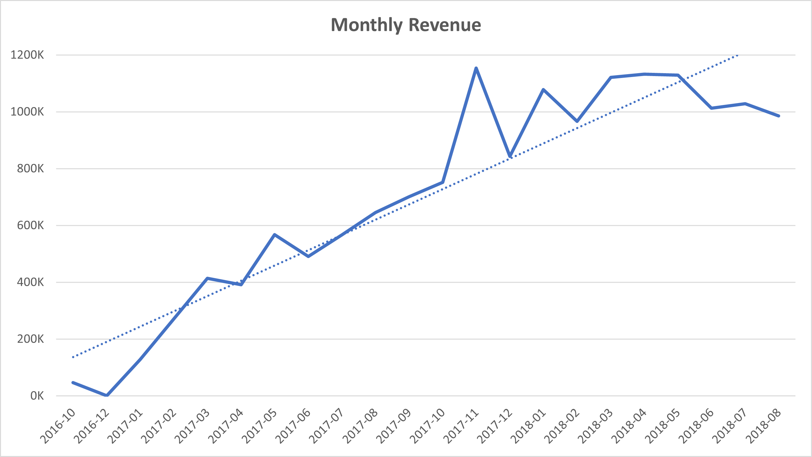
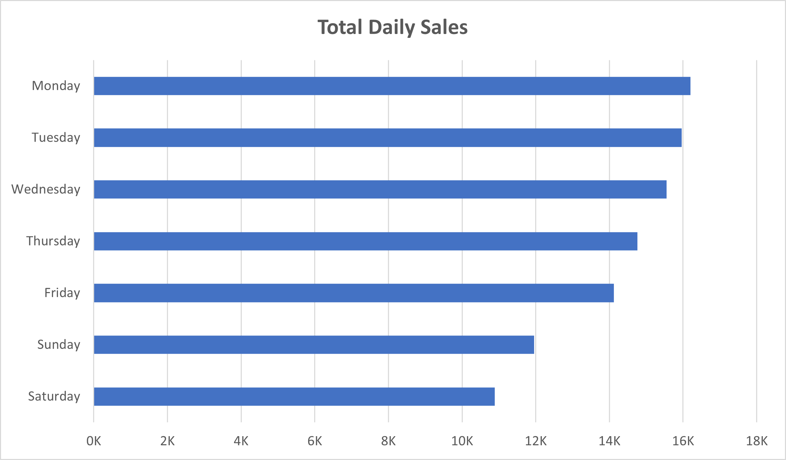
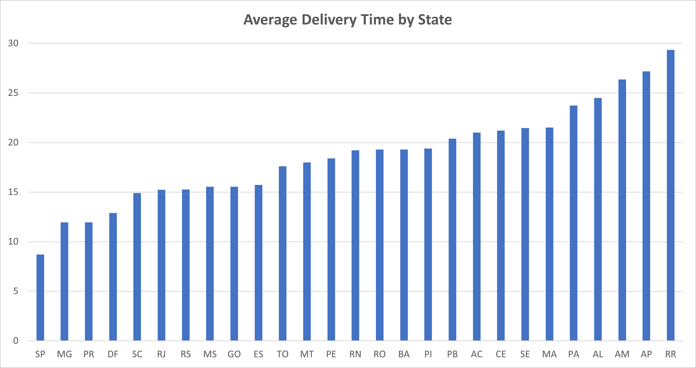
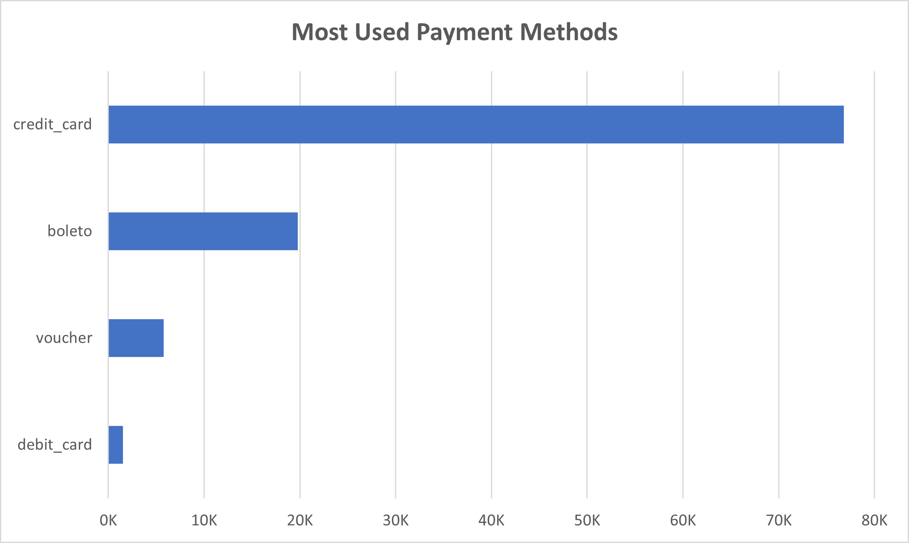
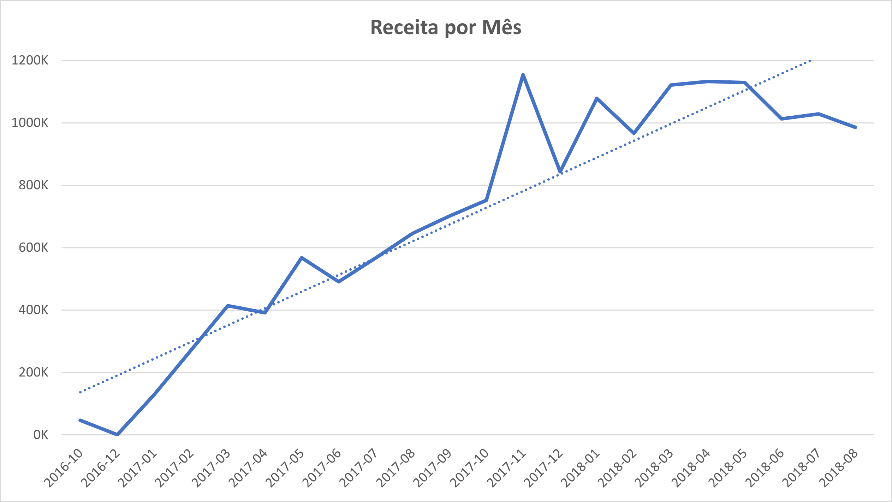
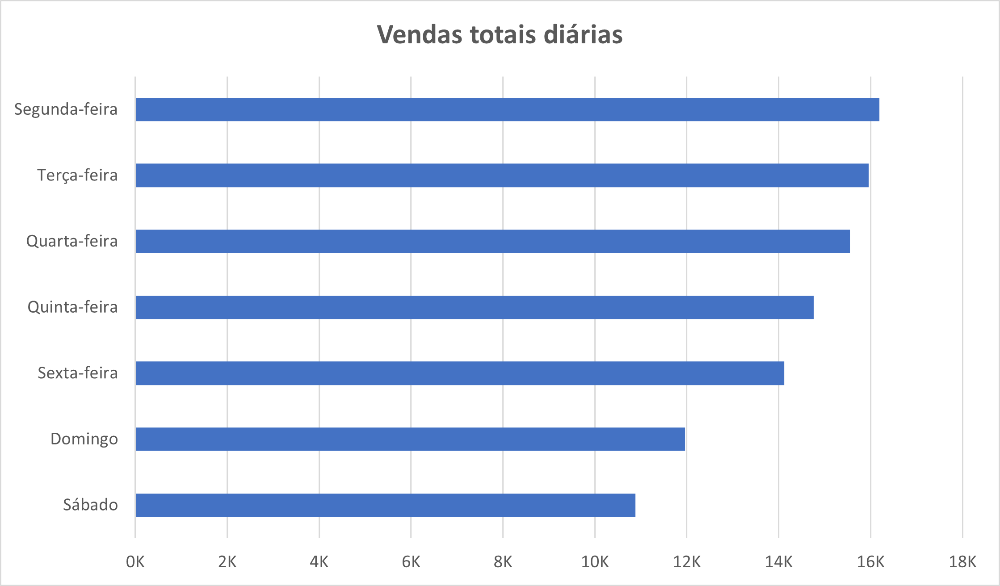
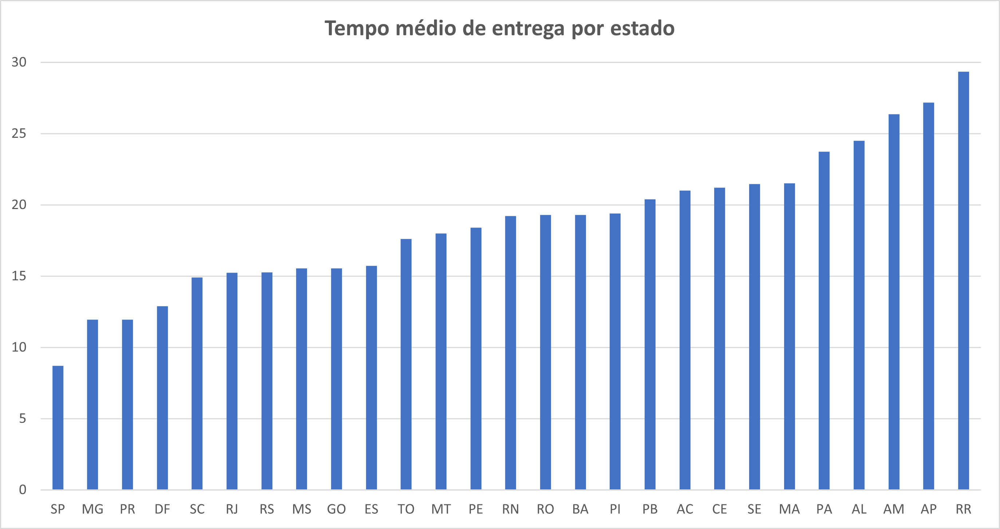
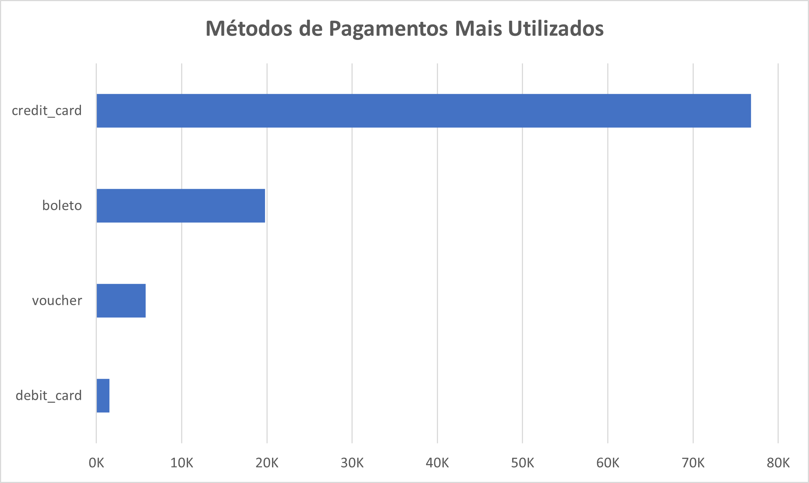

<div align="right">
<a href="#versão-em-português">Read in Portuguese</a>
</div>

# Olist E-commerce SQL Data Analysis

### Project Context
This project consists of an exploratory data analysis (EDA) of the "Brazilian E-commerce Public Dataset by Olist," available on Kaggle. The goal was to act as a data analyst and use SQL (PostgreSQL) to query the database, answering key business questions to better understand sales performance, product insights, customer demographics, and payment behaviors.

**Data Source:** [Brazilian E-commerce Public Dataset by Olist on Kaggle](https://www.kaggle.com/datasets/olistbr/brazilian-ecommerce)

**Tools Used:**
* **SQL:** PostgreSQL
* **IDE:** pgAdmin4
* **Excel:** For chart visualization

---

### Business Questions & Insights

#### Section 1: Revenue and Sales Analysis

**1.A: What is the total monthly revenue?**
* **Reasoning:** Tracking monthly revenue is a fundamental KPI for measuring business health and identifying seasonal trends. Revenue was defined here as the total payment value from orders that were effectively `delivered`, ensuring financial accuracy.
* **SQL Query:**
    ```sql
    SELECT TO_CHAR(o.order_purchase_timestamp, 'YYYY-MM') AS year_month, ROUND(SUM(p.payment_value),2) AS total_revenue
    FROM orders AS o
    INNER JOIN order_payments AS p ON o.order_id = p.order_id
    WHERE o.order_status = 'delivered'
    GROUP BY year_month
    ORDER BY year_month;
    ```
* **Insight & Result:**
    The monthly revenue analysis reveals a clear growth trend throughout the period, indicating a healthy business expansion. A significant sales peak is noticeable in November 2017, suggesting a strong impact from seasonal events like Black Friday. This demonstrates the platform's ability to capitalize on key commercial dates.

    <div align="center">
      
    </div>

**1.B: What is the average revenue per order?**
* **Reasoning:** This metric helps in understanding customer purchasing power and the effectiveness of sales strategies.
* **SQL Query:**
    ```sql
    WITH order_revenue AS (
        SELECT order_id, SUM(payment_value) AS total_per_order
        FROM order_payments
        GROUP BY order_id
    )
    SELECT ROUND(AVG(total_per_order),2) AS avg_revenue_per_order
    FROM order_revenue;
    ```
* **Insight & Result:**
    The average revenue per order was **R$ 160.99**. This value serves as an important benchmark for customer purchasing behavior, indicating a moderate average ticket value.

**1.C: Which day of the week has the highest sales volume?**
* **Reasoning:** Identifying the busiest days of the week allows for the strategic planning of marketing campaigns and promotions to maximize sales.
* **SQL Query:**
    ```sql
    SELECT
        CASE EXTRACT(DOW FROM order_purchase_timestamp)
            WHEN 0 THEN 'Sunday'
            WHEN 1 THEN 'Monday'
            WHEN 2 THEN 'Tuesday'
            WHEN 3 THEN 'Wednesday'
            WHEN 4 THEN 'Thursday'
            WHEN 5 THEN 'Friday'
            WHEN 6 THEN 'Saturday'
        END AS day_of_week, COUNT(*) AS total_orders
    FROM orders
    GROUP BY EXTRACT(DOW FROM order_purchase_timestamp)
    ORDER BY total_orders DESC;
    ```
* **Insight & Result:**
    Monday is the day with the highest volume of orders. This pattern suggests that many customers browse and decide on their purchases over the weekend but finalize the transaction on the first business day of the week.

    <div align="center">
      
    </div>

---
#### Section 2: Product Analysis

**2.A: What are the top 10 best-selling product categories?**
* **Reasoning:** Identifying the most popular product categories is crucial for inventory management, marketing focus, and understanding the main drivers of the business.
* **SQL Query:**
    ```sql
    SELECT product_category_name, COUNT(*) AS total_sold
    FROM order_items AS oi
    INNER JOIN products AS p
    ON p.product_id = oi.product_id
    GROUP BY product_category_name
    ORDER BY total_sold DESC
    LIMIT 10;
    ```
* **Insight & Result:**
    The best-selling categories are dominated by "cama_mesa_banho" (bed, bath & table), "beleza_saude" (health & beauty), and "esporte_lazer" (sports & leisure). This indicates that Olist's core business is strongly centered around home and lifestyle products.
    
    | product_category_name  | total_sold |
    |:-----------------------|:----------:|
    | cama_mesa_banho        | 11,115     |
    | beleza_saude           | 9,670      |
    | esporte_lazer          | 8,641      |
    | moveis_decoracao       | 8,334      |
    | informatica_acessorios | 7,827      |
    | utilidades_domesticas  | 6,964      |
    | relogios_presentes     | 5,991      |
    | telefonia              | 4,545      |
    | ferramentas_jardim     | 4,347      |
    | automotivo             | 4,235      |

**2.B: Which categories have the best average review score?**
* **Reasoning:** A simple average score can be misleading. To conduct a more reliable analysis and avoid skewed results from categories with very few reviews, I filtered for categories with a minimum of 20 reviews to ensure statistical relevance.
* **SQL Query:**
    ```sql
    SELECT product_category_name,ROUND(AVG(review_score),2) AS avg_score, COUNT(r.review_id) AS total_reviews
    FROM order_reviews AS r
    INNER JOIN order_items AS oi
    ON r.order_id = oi.order_id
    INNER JOIN products AS p
    ON oi.product_id = p.product_id
    WHERE p.product_category_name IS NOT NULL
    GROUP BY product_category_name
    HAVING COUNT(r.review_id) > 20
    ORDER BY avg_score DESC
    LIMIT 5;
    ```
* **Insight & Result:**
    Interestingly, the categories with the best reviews, such as "livros_interesse_geral" (general interest books), are not among the best-sellers. This suggests the existence of a niche of highly satisfied customers for specific products.

    | product_category_name              | avg_score | total_reviews |
    |:-----------------------------------|:---------:|:-------------:|
    | livros_interesse_geral             | 4.45      | 549           |
    | construcao_ferramentas_ferramentas | 4.44      | 99            |
    | flores                             | 4.42      | 31            |
    | livros_importados                  | 4.40      | 60            |
    | livros_tecnicos                    | 4.37      | 266           |

---
#### Section 3: Customer and Logistics Analysis

**3.A: Which states do most customers come from?**
* **Reasoning:** Understanding the geographical distribution of customers helps to tailor marketing efforts, plan logistics, and identify potential new markets.
* **SQL Query:**
    ```sql
    SELECT customer_state, COUNT(customer_state) AS customer_count
    FROM customers
    GROUP BY customer_state
    ORDER BY customer_count DESC
    LIMIT 5;
    ```
* **Insight & Result:**
    The customer base is overwhelmingly concentrated in the Southeast region, with São Paulo (SP) accounting for a disproportionate share of the total. This shows a strong penetration in the country's main consumer market but also highlights a significant opportunity for expansion into other regions.

    | customer_state | customer_count |
    |:--------------:|:--------------:|
    | SP             | 41,746         |
    | RJ             | 12,852         |
    | MG             | 11,635         |
    | RS             | 5,466          |
    | PR             | 5,045          |

**3.B: What is the average delivery time?**
* **Reasoning:** Delivery time is a critical factor for customer satisfaction in e-commerce. Analyzing the average time helps to assess logistical efficiency and identify bottlenecks. The calculation was based only on `delivered` orders.
* **SQL Query:**
    ```sql
    -- OVERALL
    SELECT ROUND(AVG(CAST(order_delivered_customer_date AS DATE) - CAST(order_purchase_timestamp AS DATE))) AS overall_avg_delivery_time_days
    FROM orders
    WHERE order_status = 'delivered'
    AND order_delivered_customer_date IS NOT NULL
    AND order_purchase_timestamp IS NOT NULL;

    -- BY STATE
    SELECT c.customer_state, ROUND(AVG(CAST(o.order_delivered_customer_date AS DATE) - CAST(o.order_purchase_timestamp AS DATE)),2) AS avg_delivery_time
    FROM orders AS o
    INNER JOIN customers AS c
    ON o.customer_id = c.customer_id
    WHERE o.order_status = 'delivered'
    GROUP BY c.customer_state
    ORDER BY avg_delivery_time DESC;
    ```
* **Insight & Result:**
    The overall average delivery time is **12 days**, which is relatively long by current e-commerce standards. More critically, the state-level analysis reveals a major logistical disparity across Brazil, with Northern and Northeastern states facing much longer delivery times. Improving logistical efficiency is crucial for customer satisfaction and retention in these regions.

    <div align="center">
      
    </div>

---
#### Section 4: Payment Analysis

**4.A: What are the most used payment methods?**
* **Reasoning:** Analyzing payment methods reveals customer preferences and can inform decisions about which payment partners to integrate or promote.
* **SQL Query:**
    ```sql
    SELECT payment_type, COUNT(*) AS total_uses
    FROM order_payments
    GROUP BY payment_type
    ORDER BY total_uses DESC;
    ```
* **Insight & Result:**
    Credit cards are the dominant payment method. This reinforces the importance of offering a seamless credit card payment experience, especially with installment options. "Boleto" (a Brazilian cash payment method) remains an important alternative for a segment of the population.
    
    <div align="center">
      
    </div>

**4.B: What is the average number of installments per purchase?**
* **Reasoning:** The average number of installments on credit card purchases can indicate customer financing behavior and the perceived value of the items being purchased.
* **SQL Query:**
    ```sql
    SELECT ROUND(AVG(payment_installments),2) AS avg_installments
    FROM order_payments
    WHERE payment_type = 'credit_card';
    ```
* **Insight & Result:**
    On average, credit card purchases are paid in **3.5 installments**. Combined with the average order value of R$ 160.99, this shows that customers value and use installment plans even for moderate-value purchases, indicating that this feature is a key driver for sales conversion.

---
### Conclusions and Business Recommendations

* **Conclusion 1:** The customer base is heavily concentrated in the Southeast, especially São Paulo. This suggests an opportunity for marketing campaigns targeted at other regions with growth potential, such as the South and Midwest.
* **Conclusion 2:** The average delivery time of 12 days is a competitive concern. Investing in logistics optimization is crucial. A deeper analysis is recommended to identify bottlenecks (carrier, seller posting time, etc.) and find more efficient logistics partners, especially for the North and Northeast regions.
* **Conclusion 3:** Niche categories, such as books, show the highest levels of customer satisfaction, despite not being best-sellers.
* **Conclusion 4:** With credit cards and installments being the pillars of transactions, it would be beneficial to explore partnerships to offer even more attractive installment conditions as a competitive advantage.

---
### How to Replicate this Project
1.  Download the `.csv` files from the [Kaggle link](https://www.kaggle.com/datasets/olistbr/brazilian-ecommerce).
2.  Create a new database in PostgreSQL.
3.  Run the script in `sql_scripts/1_table_creation.sql` to create the database schema.
4.  Import the data from each `.csv` file into its corresponding table.
5.  You can now run the queries from `sql_scripts/2_exploratory_analysis.sql`.

---
<a name="versão-em-português"></a>
# Análise de Dados do E-commerce Olist (SQL)

### Contexto do Projeto
Este projeto consiste em uma análise exploratória de dados (AED) do dataset público "Brazilian E-commerce Public Dataset by Olist", disponível no Kaggle. O objetivo foi atuar como um analista de dados e usar SQL (PostgreSQL) para consultar o banco de dados, respondendo a perguntas de negócio chave para entender melhor a performance de vendas, insights de produtos, demografia de clientes e comportamentos de pagamento.

**Fonte dos Dados:** [Brazilian E-commerce Public Dataset by Olist no Kaggle](https://www.kaggle.com/datasets/olistbr/brazilian-ecommerce)

**Ferramentas Utilizadas:**
* **SQL:** PostgreSQL
* **IDE:** pgAdmin4
* **Excel** Para alguns gráficos


### Perguntas de Negócio e Insights

#### Seção 1: Análise de Receita e Vendas

**1.A: Qual a receita total mensal?**
* **Raciocínio:** Acompanhar a receita mensal é fundamental para medir a saúde do negócio e identificar tendências sazonais. A receita foi definida aqui como o valor total de pagamento de pedidos que foram efetivamente `entregues`, garantindo a precisão financeira.
* **Query SQL:**
    ```sql
    SELECT TO_CHAR(o.order_purchase_timestamp, 'YYYY-MM') AS year_month, ROUND(SUM(p.payment_value),2) AS total_revenue
    FROM orders AS o
    INNER JOIN order_payments AS p ON o.order_id = p.order_id
    WHERE o.order_status = 'delivered'
    GROUP BY year_month
    ORDER BY year_month;
    ```
* **Insight e Resultado:**
    A análise da receita mensal revela uma clara tendência de crescimento ao longo do período, indicando uma expansão saudável do negócio. Nota-se um pico de vendas expressivo em novembro de 2017, o que sugere um forte impacto de eventos sazonais como a Black Friday. Isso demonstra a capacidade da plataforma de capitalizar em datas comerciais importantes.

    <div align="center">
      
    </div>

**1.B: Qual a receita média por pedido?**
* **Raciocínio:** Esta métrica ajuda a entender o poder de compra dos clientes e a eficácia das estratégias de vendas.
* **Query SQL:**
    ```sql
    WITH order_revenue AS (
        SELECT order_id, SUM(payment_value) AS total_per_order
        FROM order_payments
        GROUP BY order_id
    )
    SELECT ROUND(AVG(total_per_order),2) AS avg_revenue_per_order
    FROM order_revenue;
    ```
* **Insight e Resultado:**
    A receita média por pedido foi de **R$ 160,99**. Este valor serve como um importante benchmark para o comportamento de compra dos clientes, indicando um ticket médio de valor moderado.

**1.C: Qual o dia da semana com maior volume de vendas?**
* **Raciocínio:** Identificar os dias mais movimentados da semana permite o planejamento estratégico de campanhas de marketing e promoções para maximizar as vendas.
* **Query SQL:**
    ```sql
    SELECT
        CASE EXTRACT(DOW FROM order_purchase_timestamp)
            WHEN 0 THEN 'Domingo'
            WHEN 1 THEN 'Segunda-feira'
            WHEN 2 THEN 'Terça-feira'
            WHEN 3 THEN 'Quarta-feira'
            WHEN 4 THEN 'Quinta-feira'
            WHEN 5 THEN 'Sexta-feira'
            WHEN 6 THEN 'Sábado'
        END AS day_of_week, COUNT(*) AS total_orders
    FROM orders
    GROUP BY EXTRACT(DOW FROM order_purchase_timestamp)
    ORDER BY total_orders DESC;
    ```
* **Insight e Resultado:**
    A segunda-feira é o dia com o maior volume de pedidos. Este padrão sugere que muitos clientes pesquisam e decidem suas compras durante o fim de semana, mas finalizam a transação no primeiro dia útil da semana.

    <div align="center">
      
    </div>


#### Seção 2: Análise de Produtos

**2.A: Quais são as 10 categorias de produtos mais vendidas?**
* **Raciocínio:** Identificar as categorias de produtos mais populares é crucial para a gestão de estoque, foco de marketing e para entender os principais motores do negócio.
* **Query SQL:**
    ```sql
    SELECT product_category_name, COUNT(*) AS total_sold
    FROM order_items AS oi
    INNER JOIN products AS p
    ON p.product_id = oi.product_id
    GROUP BY product_category_name
    ORDER BY total_sold DESC
    LIMIT 10;
    ```
* **Insight e Resultado:**
    As categorias mais vendidas são dominadas por produtos de cama, mesa, banho, beleza, saúde, esporte e lazer. Isso indica que o core business da Olist está fortemente centrado em produtos para casa e estilo de vida.
    
    | product_category_name | total_sold   |
    |:----------------------|:------------:|
    | cama_mesa_banho       | 11.115       |
    | beleza_saude          | 9.670        |
    | esporte_lazer         | 8.641        |
    | moveis_decoracao      | 8.334        |
    | informatica_acessorios| 7.827        |
    | utilidades_domesticas | 6.964        |
    | relogios_presentes    | 5.991        |
    | telefonia             | 4.545        |
    | ferramentas_jardim    | 4.347        |
    | automotivo            | 4.235        |

**2.B: Quais categorias têm a melhor avaliação média?**
* **Raciocínio:** Uma simples média de avaliação pode ser enganosa. Para realizar uma análise mais confiável e evitar resultados distorcidos por categorias com pouquíssimas avaliações, eu filtrei por categorias com um mínimo de 20 avaliações para garantir relevância estatística.
* **Query SQL:**
    ```sql
    SELECT product_category_name,ROUND(AVG(review_score),2) AS avg_score, COUNT(r.review_id) AS total_reviews
    FROM order_reviews AS r
    INNER JOIN order_items AS oi
    ON r.order_id = oi.order_id
    INNER JOIN products AS p
    ON oi.product_id = p.product_id
    WHERE p.product_category_name IS NOT NULL
    GROUP BY product_category_name
    HAVING COUNT(r.review_id) > 20
    ORDER BY avg_score DESC
    LIMIT 5;
    ```
* **Insight e Resultado:**
    Curiosamente, as categorias com as melhores avaliações, como livros de interesse geral, não estão entre as mais vendidas. Isso sugere a existência de um nicho de clientes altamente satisfeitos com produtos específicos.

    | product_category_name                | avg_score | total_reviews |
    |:-------------------------------------|:---------:|:-------------:|
    | livros_interesse_geral               | 4,45      | 549           |
    | construcao_ferramentas_ferramentas   | 4,44      | 99            |
    | flores                               | 4,42      | 31            |
    | livros_importados                    | 4,40      | 60            |
    | livros_tecnicos                      | 4,37      | 266           |


#### Seção 3: Análise de Clientes e Logística

**3.A: De quais estados vêm a maioria dos clientes?**
* **Raciocínio:** Entender a distribuição geográfica dos clientes ajuda a personalizar esforços de marketing, planejar a logística e identificar potenciais novos mercados.
* **Query SQL:**
    ```sql
    SELECT customer_state, COUNT(customer_state) AS customer_count
    FROM customers
    GROUP BY customer_state
    ORDER BY customer_count DESC
    LIMIT 5;
    ```
* **Insight e Resultado:**
    A base de clientes é massivamente concentrada na região Sudeste, com São Paulo (SP) representando uma parcela desproporcional do total. Isso demonstra uma forte penetração no principal mercado consumidor do país, mas também aponta para uma grande oportunidade de expansão em outras regiões.

    | customer_state | customer_count |
    |:--------------:|:--------------:|
    | SP             | 41.746         |
    | RJ             | 12.852         |
    | MG             | 11.635         |
    | RS             | 5.466          |
    | PR             | 5.045          |

**3.B: Qual o tempo médio de entrega?**
* **Raciocínio:** O tempo de entrega é um fator crítico para a satisfação do cliente no e-commerce. Analisar o tempo médio ajuda a avaliar a eficiência logística e a identificar gargalos. O cálculo foi baseado apenas em pedidos `entregues`.
* **Query SQL:**
    ```sql
    -- GERAL
    SELECT ROUND(AVG(CAST(order_delivered_customer_date AS DATE) - CAST(order_purchase_timestamp AS DATE))) AS overall_avg_delivery_time_days
    FROM orders
    WHERE order_status = 'delivered'
    AND order_delivered_customer_date IS NOT NULL
    AND order_purchase_timestamp IS NOT NULL;

    -- POR ESTADO
    SELECT c.customer_state, ROUND(AVG(CAST(o.order_delivered_customer_date AS DATE) - CAST(o.order_purchase_timestamp AS DATE)),2) AS avg_delivery_time
    FROM orders AS o
    INNER JOIN customers AS c
    ON o.customer_id = c.customer_id
    WHERE o.order_status = 'delivered'
    GROUP BY c.customer_state
    ORDER BY avg_delivery_time DESC;
    ```
* **Insight e Resultado:**
    O tempo médio geral de entrega é de 12 dias, um prazo relativamente longo para os padrões atuais do e-commerce. Mais criticamente, a análise por estado revela uma grande disparidade logística pelo Brasil, com estados do Norte e Nordeste apresentando prazos muito superiores. Melhorar a eficiência logística é um ponto crucial para a satisfação e retenção de clientes nessas regiões.

    <div align="center">
      
    </div>


#### Seção 4: Análise de Pagamentos

**4.A: Quais são os métodos de pagamento mais utilizados?**
* **Raciocínio:** Analisar os métodos de pagamento revela as preferências dos clientes e pode informar decisões sobre quais parceiros de pagamento integrar ou promover.
* **Query SQL:**
    ```sql
    SELECT payment_type, COUNT(*) AS total_uses
    FROM order_payments
    GROUP BY payment_type
    ORDER BY total_uses DESC;
    ```
* **Insight e Resultado:**
    O cartão de crédito é o método de pagamento dominante. Isso reforça a importância de oferecer uma experiência de pagamento com cartão de crédito fluida e, especialmente, opções de parcelamento. O boleto segue como uma alternativa importante para uma parcela da população.
    
    <div align="center">
      
    </div>

**4.B: Qual o número médio de parcelas por compra?**
* **Raciocínio:** O número médio de parcelas em compras com cartão de crédito pode indicar o comportamento de financiamento do cliente e o valor percebido dos itens comprados.
* **Query SQL:**
    ```sql
    SELECT ROUND(AVG(payment_installments),2) AS avg_installments
    FROM order_payments
    WHERE payment_type = 'credit_card';
    ```
* **Insight e Resultado:**
    Em média, as compras no cartão de crédito são pagas em 3,5 parcelas. Combinado com a receita média por pedido de R$ 160,99, isso mostra que os clientes valorizam e utilizam a opção de parcelamento mesmo para compras de valor moderado, indicando que esta é uma funcionalidade chave para a conversão de vendas.


### Conclusões e Recomendações de Negócio

* **Conclusão 1:** A base de clientes é fortemente concentrada na região Sudeste, especialmente em São Paulo, o que pode indicar uma oportunidade para campanhas de marketing direcionadas a outras regiões com potencial de crescimento, como o Sul e o Centro-Oeste.
* **Conclusão 2:** O tempo médio de entrega de 12 dias é um ponto de atenção competitivo. Investir em otimização logística é crucial. Recomenda-se uma análise mais profunda para identificar os gargalos (transportadora, tempo de postagem do vendedor, etc.) e buscar parcerias logísticas mais eficientes, especialmente para as regiões Norte e Nordeste.
* **Conclusão 3:** Categorias de nicho, como livros, apresentam os maiores níveis de satisfação do cliente, mesmo não sendo as mais vendidas.
* **Conclusão 4:** Sendo o cartão de crédito e o parcelamento os pilares das transações, seria interessante explorar parcerias para oferecer condições de parcelamento ainda mais atrativas como diferencial competitivo.


### Como Replicar este Projeto
1.  Faça o download dos arquivos `.csv` do [link do Kaggle](https://www.kaggle.com/datasets/olistbr/brazilian-ecommerce).
2.  Crie um novo banco de dados no PostgreSQL.
3.  Execute o script em `sql_scripts/1_table_creation.sql` para criar o schema do banco de dados.
4.  Importe os dados de cada arquivo `.csv` para sua tabela correspondente.
5.  Agora você pode executar as queries de `sql_scripts/2_exploratory_analysis.sql`.
